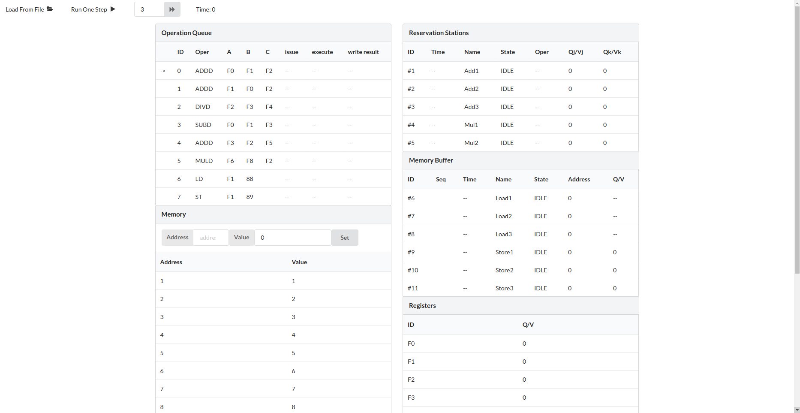
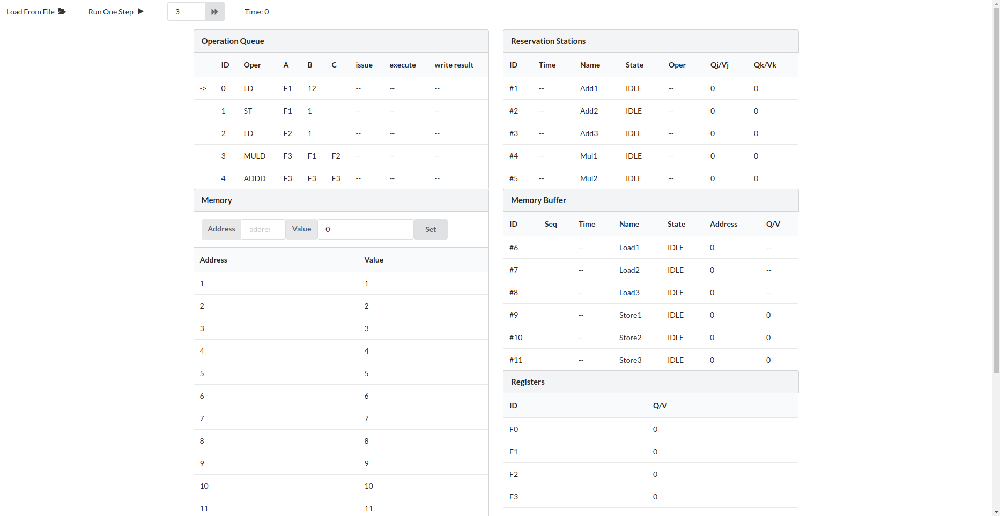
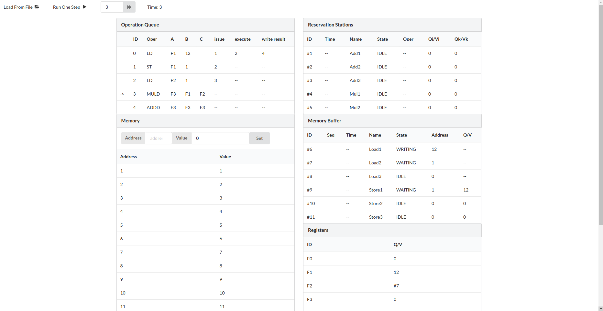
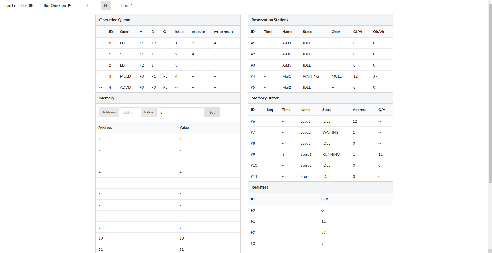
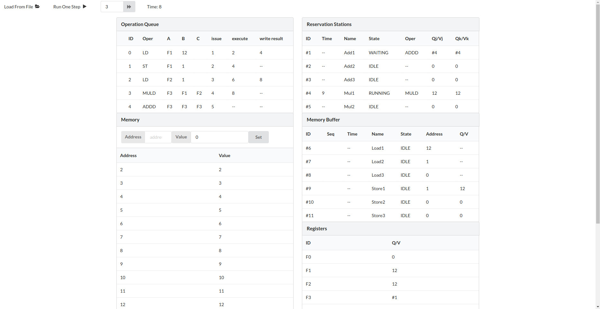

# 系统结构第二次试验：设计实现Tomasulo调度算法

### 实验小组成员

计42 2014011320 殷达
计42 2014011315 陈光斌
计42 2014011290 王栋

## 一、实验原理

Tomasulo算法以硬件的方式实现了寄存器的重命名，在一定程度上允许指令乱序执行以提高流水线吞吐率及效率。在该次实验中，设计的Tomasulo模拟器的硬件结构为简化版。

Tomasulo算法主要分成三个阶段：Issue阶段发射指令，Execute阶段执行指令，Write Back阶段写回结果。
在流水线运行时，先检查当前指令队列是否有指令，如果有，查看是否有相应空闲的保留站，如果有则取出并放入保留站中进入等待执行状态，如果没有则暂停指令的加载。加载指令后，需要将该指令的写回寄存器在寄存器堆中的值标记为依赖相应载入的保留站。这是Issue阶段。
在准备执行的过程中，先检查当前的运算部件是否空闲，如果不空闲则等待下一个时钟周期继续检查；空闲时，检查当前要执行的指令操作数是否已经全部准备就绪（在寄存器堆中查找相应寄存器，检查是否依赖在别的保留站结果上），如果都准备就绪，则将指令载入运算部件中运算，否则继续等待。运算完成的指令进入写回阶段。
在写回阶段，将指令对应更新所有依赖在该保留站上的其他指令操作数，同时写回对应寄存器。

以上便是Tomasulo算法的基本流程。

## 二、实验参数设置

在该实验中，我们的模拟器简化了指令在Execute阶段的执行，在这个阶段我们没有做多段流水线的操作。事实上，在真实的浮点数运算部件中，也是采用流水线方式来实现的，也就是说在同一个浮点数运算部件中，可能有多条浮点数运算指令正分别在不同阶段执行。比如浮点数乘法部件有六段流水线的话，那么当先进入的浮点数指令进入到后续的流水段中时，后面的指令可以进入浮点数运算部件的前一段流水段进行计算，如此可以进一步提高流水线的吞吐量和效率。这次试验重点在于模拟Tomasulo算法，因此我们就没有实现浮点运算的多段流水线。

除此之外，在此次实验中，我们认为从指令队列中流入的指令必须要驻留在空闲的保留站中，而不能直接进入运算部件。这样可以使各个指令的运算流程得到统一的处理。同时，我们认为浮点数乘法和除法公用一个运算部件。

我们还做出以下规定，在先前的访存指令没有执行（此处特指Execute阶段）结束的情况下，后续的访存指令不能开始执行，以保证诸如`ST F1 2015, LD F2 2015`这样指令序列的正确执行。

另外`ADD A B C`的指令含义为`A <- B + C`。

## 三、实验环境

我们采用了基于Vue.js的JavaScript来实现Tomasulo算法的模拟。界面采用semantic进行美化。JavaScript采用了ECMAScript6标准，并使用了一些新特性，所以建议在较新的浏览器里运行。

我们的模拟器可以通过加载index.html页面来访问。项目中的jquery.min.js/vue.min.js/semantic.min.js均为运行时的依赖库。semantic.min.css是样式文件。主要的执行代码在tomasulo.js中。有input1和input2两份可供测试使用的文件。为了程序测试，我们的内存初始化1～19为1～19.

模拟器的界面

其中，左上角的`Load From File`按钮可以从本地文件系统中加载文件。比如input1, input2。上图为加载input1以后的状态。操作栏里面的`Run One Step`可以用来进行单步调试操作，其右侧可以通过输入正整数快速运行多步。最右侧是当前所处的周期数（末尾状态，如上图的Time:0代表当前正处于第0个时钟周期结束准备进入第1个时钟周期）。

在下侧的页面内容中，左侧的Operation Queue是加载进入的指令队列，箭头所指的是下一条待Issue的指令。ID为其编号，Oper为其操作内容，ABC是其操作数。issue记录该指令Issue的时间，execute记录该指令开始运算/访存的时间，write result为该指令开始Write Back的时间。
再下侧的Memory为内存操作模块。在下方显示了所有值不为0的内存单元。通过该模块最上方的Address/Value输入，可以手动指定内存单元的值。需要注意的是，更新过的内存单元会放到最下方，而非按照地址大小排序。
右侧上方两个模块，分别是浮点数运算保留站（3个加减法操作保留站，2个乘除法操作保留站）；访存缓冲区（3个Load Buffer，3个Store Buffer）。在浮点数运算保留站和访存缓冲区中ID表示该保留站的编号，State代表该保留站中指令的状态，IDLE代表空闲等待加载指令/ISSUED代表刚刚加载完指令/WAITING表示处于等待状态（有可能是由于运算部件忙也有可能是由于依赖的操作数没计算完）/RUNNING表示正在运行/WRITING表示正准备写回。Time表示在运行阶段还需要运行的时间，Q/V表示操作数的内容，纯数字表示值，#+数字表示依赖的保留站编号。浮点数保留站中的Oper记录具体的操作，访存缓冲区中的Address记录要访存的地址，Seq表示访存的序号。
最下方的Registers中，记录了寄存器堆的内容，同样的，纯数字表示值，#+数字表示依赖的保留站编号。

## 四、实验代码

主要的逻辑代码都在tomasulo.js中。

`OpBuilder`读取一行内容，转化为了一个Operation操作对象。该函数主要是为了帮助读取文件内容。
`Operation`该类用来存储一条指令对象，包括其ID，操作数，各个执行阶段的时间。
`QV`是一个用来解释寄存器或者操作数值的类，当Q为0的时候，其内容是实际的值V，当Q不为0的时候，其内容依赖在Q号保留站上。类`Register`便是基于QV的。
`ReservationStation`是保留站。里面有它的名称、状态、所需运行时间、操作等内容。具体又分成`ALUReservationStation`浮点数保留站以及`MemoryBuffer`访存缓冲区。`MemoryBuffer`又进而划分成`LoadBuffer`和`StoreBuffer`。不同的ReservationStation实现了不同的具体内容。

`clearArray`,`removeArray`,`addArray`是一些辅助操作，由于javascript中关于数组的一些操作不能直接反映在vue绑定的显示部件上，所以用较为复杂的方式重新实现了一下一些相应功能，方便更新数据在界面上。
`loadFile`则是实现了从文件中读取指令的功能。`storeMemory`和`loadMemory`是具体的访存操作。

`runOneStep`以及`runNStep`是单步运行和多步运行的入口函数，里面具体使用了`issue`和`execute`两个函数（write back操作包含在execute函数中）。
在`issue`函数中，检查指令序列的下一条指令，看看是否有对应的空闲保留站，如果有那么issue这条指令，加载入保留站中并更新寄存器堆中对应输出寄存器的内容。如果没有空闲保留站，则暂停指令流入。
在`execute`函数中，依次检查浮点数加减保留站、浮点数乘除保留站、Load访存缓冲区、Store访存缓冲区。首先检查是否有运行结束（处于WRITING状态）的保留站，将其改为IDLE状态。如果有正在执行（处于RUNNING状态）的保留站，更新其剩余时间，如果处理完成，将该保留站编号加入到通知队列中，并转入WRITING状态；如果没有，则寻找一个操作数已经就绪的保留站将其置于运行状态。然后将通知队列中的保留站编号依次取出，更新所有依赖在这些保留站上的操作数以及寄存器内容（实际寄存器的内容要在Write Back完成后才写回，但是由于在execute阶段完成后，所有依赖在该寄存器上的值都被更新，要进入的指令也能够被旁路给出所需要的数据，因此这里就直接更新寄存器的值了）。最后将所有刚刚ISSUE过的指令转入WAITING状态。

## 五、实验DEMO简述

在这里用input2做一个简单的实验操作流程描述。
首先点击左上角`Load From File`加载input2文件进入。input2的内容如下

```assembly
LD F1,12
ST F1,1
LD F2,1
MULD F3,F1,F2
ADDD F3,F3,F3
```

加载完成后界面如下，正准备加载第一条指令`LD F1, 12`此时，地址12中存储的内容是12.
然后点击`Run One Step`，得到
此时，第1条指令被Issue到6号访存缓冲区中，同时F1寄存器的内容指向6号访存缓冲区的结果。
执行下一步
看到第二条指令被issue到9号访存缓冲区，其操作数为F1，F1依赖#6，因此该操作数的内容为6号访存缓冲区的结果，第一条指令开始执行load操作，进入RUNNING状态，在第2个时钟周期结束时，还剩下1个时钟周期待执行。

然后第三个时钟周期运转，加载第三条指令`LD F2 1`.尽管其操作数已经满足，但是它排在之前的`ST F1 1`后面，所以不能执行，因此要等待。在这个时钟周期运转结束时，6号访存缓冲区中的`LD F1 12`已经执行完毕，进入WRITING状态，并将所有依赖在6号访存缓冲区的操作数更新。可以看到9号访存缓冲区的操作数从#6转变为12.

继续执行下一步，`MULD F3 F1 F2`被issue到4号保留站中，其中F1此时已经得到为12，直接填入；F2依赖在7号访存缓冲区的结果上，因此标记为#7。最开始的6号访存缓冲区写回完毕，上一条指令执行完毕，回到IDLE状态。

下一步执行结束后，指令序列中已经没有需要issue的指令了。此时`ST F1 1`指令执行结束，#9进入IDLE状态（ST操作不需要写回，直接进入IDLE状态）。然后是进行`LD F2 1`的执行，将刚刚存到1中的12加载到F2中。
此时，`LD F2 1`的访存已经结束，正准备写回，访存得到的F2的结果可以回填到4号保留站中，从而使4号保留站可以开始计算。接下来跳过8步，直接让`MULD F3 F1 F2`运行结束，准备WRITING。回填到1号保留站中，让`ADDD F3 F3 F3`开始运行。运行结束，得到F1,F2,F3的结果12,12,288.

根据以上的步骤可以类似地加载执行input1中的指令序列。同样的，你可以自己定义自己的指令序列并保存到文件中，通过`Load From File`来加载。

## 六、实验小结

Tomasulo算法对于需要不同执行周期的指令流水能够在保证不发生冲突且逻辑正确的情况下乱序执行指令从而提高流水线的效率，这对于有浮点数运算部件的流水线很有益处。
此次实现Tomasulo算法做了一些简化操作，但Tomasulo乱序执行指令以及寄存器重命名的核心部分都完完整整地实现了。这个实验加深了我们对于流水线动态调度的理解，对于现代计算机中CPU内核的实现细节有了更加全面的认知。

另外，因为采用HTML+JavaScript的方式实现，所以可以很轻松的部署到web端发布。
项目网址：https://somefive.github.io/tomasulo/